[简体中文](README.md) | [English](README.en.md)


# PhotoProof · 摄影工作室客户选片与修图交付系统

**知华科技（上海如静知华信息科技有限公司）** · [官网](https://www.zhuatech.cn/)

Java 21 / Spring Boot / Vue 3 / MySQL 8。**源码公开、非商业使用；仅限个人学习交流，商用须书面授权。**

## 项目简介与适用场景

PhotoProof供摄影师、摄影工作室及商业产品摄影团队管理客户选片、加选费用确认、修图版本和文件交付。客户用手机或电脑看带水印样片，按套餐选片并留下修图备注；修图人员上传独立版本，客户认可最新版本且外部收款足额后才开放最终文件下载。

适合人像、婚纱/婚礼、活动和产品摄影的单个经营主体。个人摄影师可以独立执行员工流程，客户仍须使用真实客户入口进行选片与认可。系统不要求虚设第二个审批员工，也不允许员工伪造客户确认。多个工作室属于同一经营主体，不是跨公司SaaS。

## 已实现功能

| 工作流 | 已实现内容 |
| --- | --- |
| 客户与项目 | 客户新增、修改、停用、CSV原子导入；项目、摄影师与修图人员、拍摄分类和日期 |
| 套餐与选片 | 最少/含片/最多数量、基础价、单张加选价；客户逐张选择、筛选已选、备注、费用明确确认与轮次冻结 |
| 照片存储 | 真实JPEG/PNG上传、10MB与2400万像素限制、每项目100张样片、受限总容量；随机私有文件键、服务器实际生成水印预览与缩略图 |
| 修图与认可 | 对选中样片上传独立版本；必须全部有文件才可送审；精确最新版本认可、要求修改、保留历史轮次与文件 |
| 收款与交付 | 核实后的外部收款、退款、错误登记冲销；引用链与金额保护；足额且认可后原文件与ZIP下载；客户确认收讫归档 |
| 账号与后台 | 实际账号、客户固定绑定、强密码、启停、密码重置；角色、权限名称接口、菜单、工作室、拍摄字典及有界参数管理 |
| 范围与分享 | 全部/所在工作室/本人指派/绑定客户范围；单项目限时链接、8位访问码、二维码、撤销即时失效 |
| 报告与维护 | 按币种经营统计、CSV导出、项目事件及审计；一致数据库/照片备份和独立恢复脚本；中英文界面 |

**外部收款记录不代表系统实际到账或转账。** 没有支付、邮件、短信、AI修图、RAW/视频处理或云存储集成。未实现的能力见下方限制。

## 业务状态

草稿 → 选片 → 修图 → 客户审阅 → 待交付 → 已交付 → 已归档。客户要求修改返回修图。交付前可有原因地重新开放选片，旧轮次保留；已收款超过基础价时须先实际退款并登记。取消或过期关闭客户画廊访问，历史与款项保留；已经下载的文件无法远程收回。

## 技术架构

浏览器经同源Nginx访问Vue页面与Spring Boot API；Spring Security使用服务端会话和CSRF，JPA事务与Flyway连接MySQL 8.4。照片原文件、水印预览和缩略图保存在独立私有媒体卷，数据库保存业务与校验信息，不把原文件路径交给客户。下载每次重新核对角色、项目、期限、当前版本、客户认可和净收款。

核心变更使用版本检查及实例写锁，面向小型工作室，未做多实例或高并发性能承诺。详见[架构与业务约定](docs/architecture.md)、[安全说明](docs/security.md)及[接口说明](docs/api.md)。

## 目录结构

```text
backend/src/main/java/cn/zhuatech/photoproof/  # business, access, storage, HTTP
backend/src/main/resources/db/migration/     # versioned MySQL schema
backend/src/test/                            # real HTTP/JPA/file tests
frontend/src/                               # Vue staff/client UI and tests
frontend/public/brand/                      # original logo and contact images
docs/                                      # architecture, operation, security
scripts/                                   # private initialization, QA, backup/restore
compose.yaml                               # MySQL, private media, backend, frontend
.env.example                               # configuration names; no credentials
```

## 环境要求与安装启动

推荐Docker Engine 27+与Docker Compose v2，至少4GB可用内存及足够照片磁盘。源码构建使用Java 21、Maven 3.9、Node 24.19.0及npm；测试辅助脚本使用Python 3.11+。Spring Boot 4.0.7、Vue 3.5.40、Vite 8.1.5；依赖版本见pom.xml和package-lock.json。

```sh
python3 scripts/init-env.py
docker compose -p photoproof up --build -d
docker compose -p photoproof ps
```

打开 http://127.0.0.1:8125 。初始账号是`.env`中的`ADMIN_USERNAME`，密码从本机私有`.env`读取`ADMIN_PASSWORD`。初始化脚本生成独立随机强密码，拒绝覆盖已存在文件；仓库不提供通用演示密码。先添加客户，再建客户登录账号和项目，上传样片后发布；详见[操作手册](docs/operation.md)。

## 数据库初始化与数据存储

全新MySQL卷首次启动时自动执行`V1__photo_schema.sql`，建立17张应用表和Flyway历史表。只初始化管理员、6个岗位角色、权限、菜单、1个工作室、拍摄分类和4个参数，**不预置客户、照片、项目或资金**。截图中的TEST数据由实际验收流程创建，不会随正常部署自动出现。重启不改写现有账号密码或业务；不得修改已应用迁移文件。

`mysql-data`保存数据库，`media-data`保存照片。删除任一卷都可能造成业务损坏；日常停止用`docker compose -p photoproof stop`，不要用带`-v`的清理命令处理启动问题。

## 配置说明

| 配置 | 含义 |
| --- | --- |
| MYSQL_ROOT_PASSWORD / DATABASE_PASSWORD | 独立数据库口令，初始化脚本自动生成 |
| ADMIN_USERNAME / ADMIN_PASSWORD | 仅空数据库首次初始化使用；后续密码通过账号管理修改 |
| WEB_PORT / BIND_ADDRESS | 默认8125与127.0.0.1；公网/局域网使用前配置可信HTTPS及受限网络 |
| COOKIE_SECURE | HTTPS部署设true；仅本机HTTP测试为false |
| DATABASE_URL / DATABASE_USER | 可选外部MySQL；生产外部连接使用VERIFY_IDENTITY和可信CA |
| MEDIA_ROOT | 后端配置项，Compose固定映射`/data/media`到私有持久卷 |

后台参数：`gallery_days`1–365天、`link_hours`1–168小时、`max_job_mb`10–4096MB（默认512）、`watermark`1–32个英文字符。参数对后续发布、分享或新上传生效；既有水印不会被暗中替换。工作室使用CNY、USD、EUR、GBP或HKD两位小数币种；有项目后币种和时区锁定。

## 测试方式

```sh
mvn -B -f backend/pom.xml spotless:check test package
cd frontend
npm ci --no-audit --no-fund
npm run format:check
npm run lint
npm test
npm run build
cd ..
python3 scripts/release-check.py
```

后端33项HTTP/JPA/实际照片测试覆盖完整状态、精确金额、范围、版本、并发选片、管理员保护、过期/撤销、真实文件与下载控制；前端11项测试覆盖CSV、精确版本选择、CSRF和不重试未知写入。格式、ESLint、构建和镜像内测试均须通过；Docker Maven构建不跳过测试。

独立测试实例中可执行以下流程；它会创建标记为TEST的客户、账号和原创几何样片，**不要在生产库运行**。测试状态含随机临时密码，仅保存在忽略的output目录，不能上传。

```sh
python3 -m venv .venv
.venv/bin/python -m pip install -r scripts/requirements-quality.txt
.venv/bin/python scripts/quality.py --url http://127.0.0.1:8125
.venv/bin/python scripts/verify-persistence.py --url http://127.0.0.1:8125 --report output/restart-quality.json
```

## 部署、备份与恢复

自部署需要自己的域名、可信HTTPS反向代理、受限网络和容量监控，设置COOKIE_SECURE=true；数据库与媒体目录不直接公开。后台与客户入口使用同一个部署地址。手机不能用手机自身的127.0.0.1访问电脑，分享二维码必须指向客户可达的域名或局域网地址。

```sh
python3 scripts/backup.py --project photoproof --output private-backups/photoproof.zip
python3 scripts/restore.py private-backups/photoproof.zip --project photoproof-recovery --env-file .env.recovery
```

备份暂时停止后台写入并恢复服务，同时包含数据库及照片卷；备份含私人资料须安全保存。恢复前自行准备私有`.env.recovery`，使用不同端口及独立MySQL口令。恢复脚本拒绝覆盖已有容器或数据卷，并核对备份散列与媒体路径。恢复后核对健康、项目、权限、审计和文件散列，详见[部署说明](docs/deployment.md)。

## 当前运行截图

以下都是实际运行页面；全部业务资料标记TEST，图片为原创几何测试样片，没有真实客户资料、密码、密钥或分享凭据。不使用设计稿冒充功能。

### 登录页

员工或客户账号登录；没有公开默认密码。

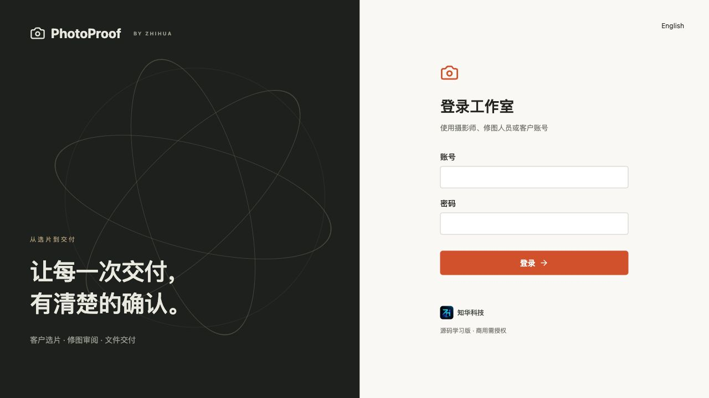

### 摄影项目

按客户、状态与负责人查看项目及款项。

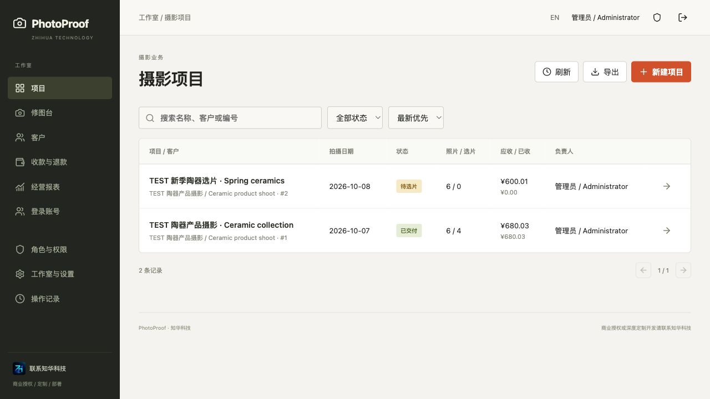

### 客户选片

真实水印样片、数量限制、修图备注与加选报价。

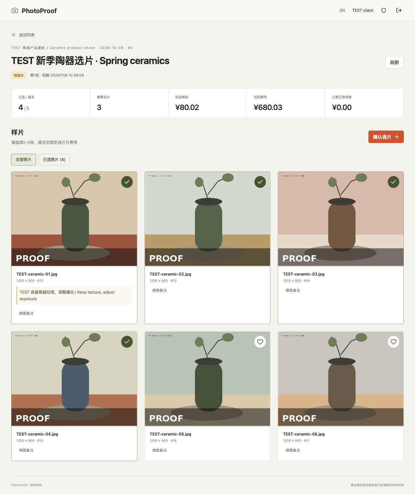

### 修图交付

当前轮次的最新文件预览、客户认可与修改请求。

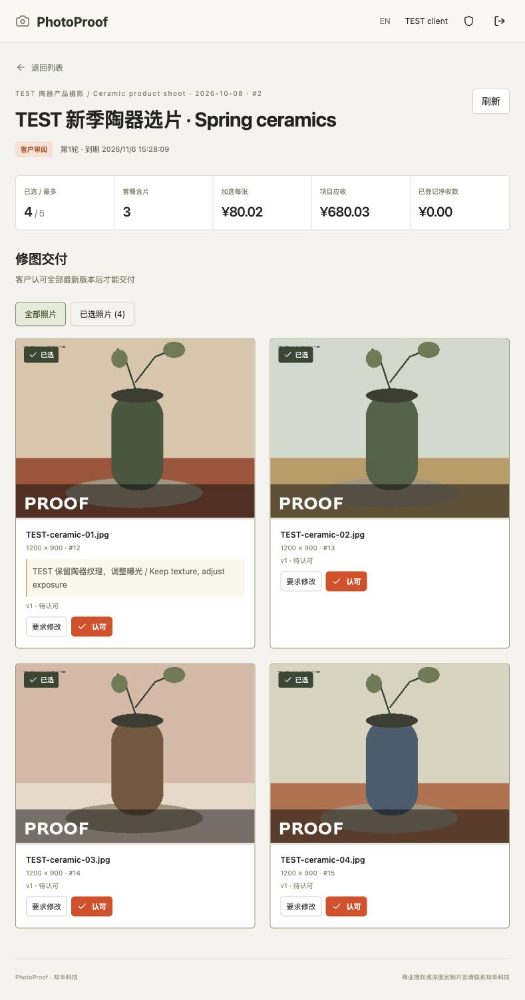

### 修图工作台

选中样片、客户备注、不可覆盖的修图版本。

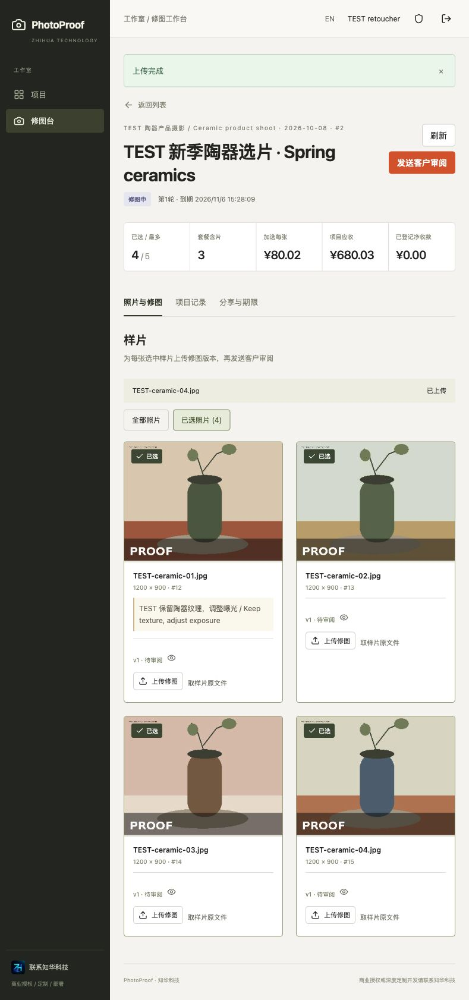

### 账号管理

员工/客户身份、角色、工作室、启用和密码管理。

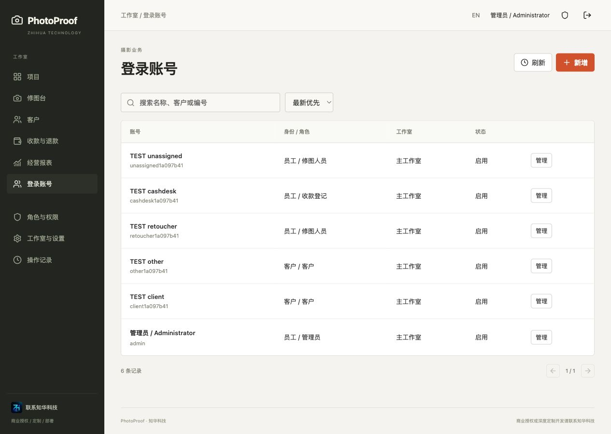

### 角色权限

岗位与全部、工作室、指派、客户范围。

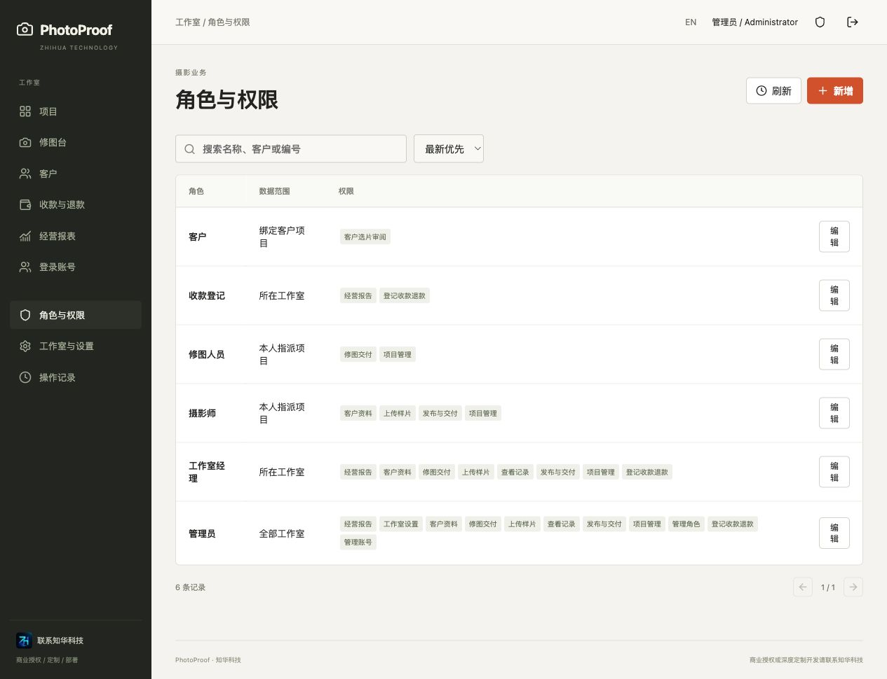

### 客户管理

客户资料、新增修改、停用与原子CSV导入。

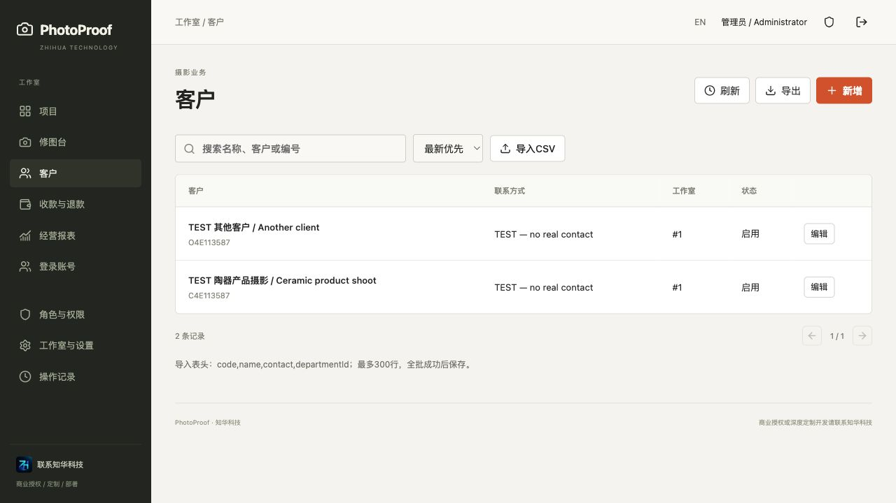

### 外部收款

核实后登记收款、退款和错误记录冲销。

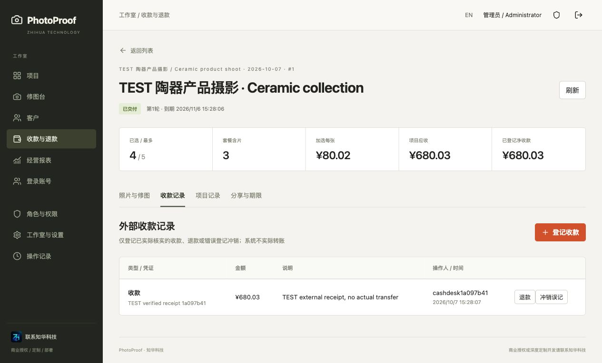

### 经营报告

按币种统计应收和净收款。

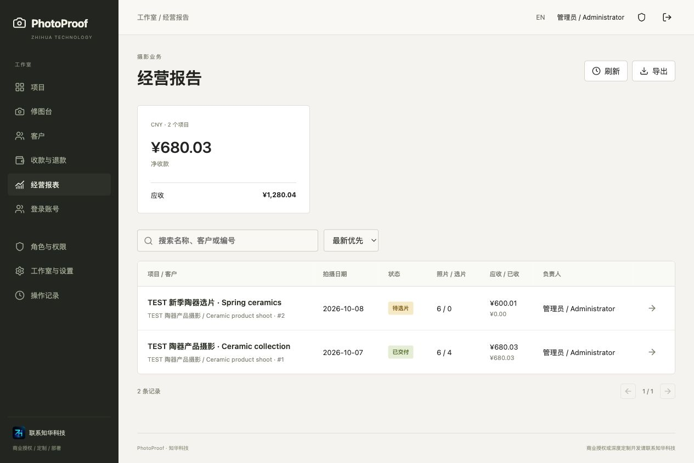

### 工作室设置

工作室、拍摄分类、菜单与有界参数。

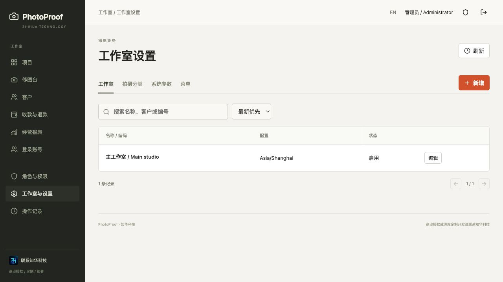

### 手机选片

390×844视口的实际客户选片页面。

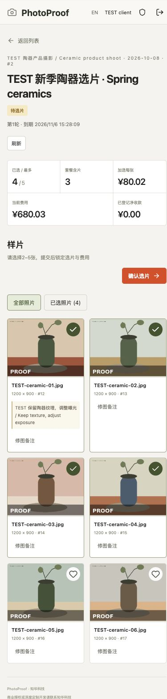

### 最终文件下载

客户足额收款且认可后，通过浏览器流式保存当前文件。

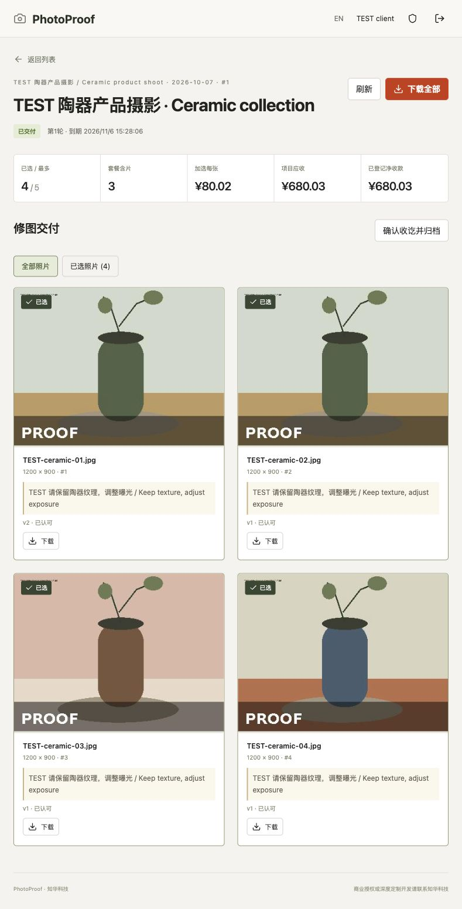

## 已知限制

- JPEG/PNG仅限10MB、2400万像素、单边10000像素；最多100张样片/项目。没有RAW、HEIC、视频、自动人脸识别或AI修图，需外部修图软件。
- 预览重新编码，不承诺处理所有相机EXIF方向或颜色配置；原文件保持字节与元数据，部署方须检查原文件隐私及方向。不提供可防截屏的水印。
- 资金为外部事实登记，无在线支付、发票、税务、合规电子签名、收款到账或退款执行保证。
- 单一经营主体、多工作室；不提供独立租户SaaS、SSO、MFA、跨节点限流、外部邮件/SMS或对象存储SDK。
- 查询目录有10000条上限，照片容量包含历史文件；软删除不释放历史字节。ZIP限500MB，超限逐张下载。没有自动清理或已下载文件远程撤回。
- 受限的独立测试不能代替部署方自身的安全审计、容量、浏览器设备与经营规则验收；不声称已完成生产验证。

## 授权、反馈与联系知华科技

仅限个人学习、技术研究与非商业交流；未经**上海如静知华信息科技有限公司**书面授权不得商用，包括企业部署、客户交付、二次销售或SaaS经营。以[LICENSE](LICENSE)为准；这是“源码公开、非商业使用”，不是MIT、Apache或OSI标准开源许可证。第三方组件保留各自许可证，见[第三方声明](docs/third-party.md)。

问题反馈请给脱敏复现和环境，不提交照片、客户资料、口令、会话或数据库。贡献保留品牌与许可，提交小范围修改及验证。安全问题请通过官网或联系人私下反馈。

**商业授权或深度定制开发请联系知华科技。** 服务包括商业源码授权、品牌适配、私有部署、客户资料迁移、选片规则与交付流程定制、对象存储/通知/收款接口适配及系统集成。接口适配是可咨询服务，不表示本版本已集成。

官网：https://www.zhuatech.cn/ 。咨询微信：**zhuatech**、**zhuatech2**。

<table><tr><td align="center"><br>微信：zhuatech</td><td align="center"><br>微信：zhuatech2</td></tr></table>
